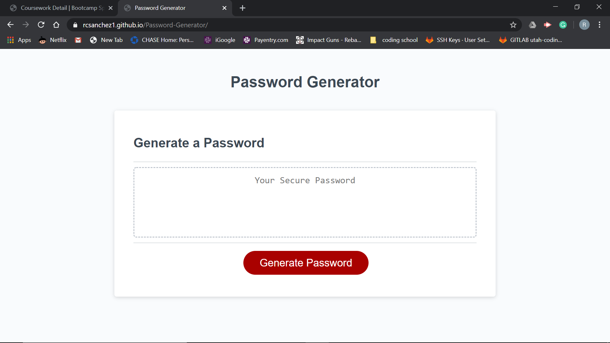

# Password-Generator
 
 I found this homework very fun to do yet difficult. I Like how javascript has more of a structure to working with it and how i was able to make something with a funtionality. I tried my best with this homework and i hope i got all the things i needed in the assignment. Here is the link for my project https://rcsanchez1.github.io/Password-Generator/

